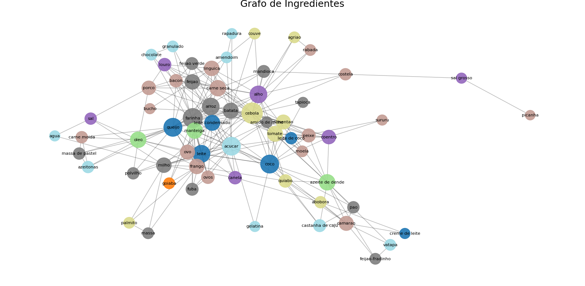

  

 

<strong>UNIVERSIDADE FEDERAL DO RIO GRANDE DO NORTE</strong>

 
DEPARTAMENTO DE ENGENHARIA DE COMPUTAÇÃO E AUTOMAÇÃO  
DCA3702 - ALGORITMOS E ESTRUTURAS DE DADOS II

<h2 align="center"><strong>PROJETO 02</strong></h2>

DISCENTES: MINNAEL CAMPELO DE OLIVEIRA, 	20250051785

DOCENTE: IVANOVITCH MEDEIROS DANTAS DA SILVA

NATAL/RN 2025  

---
### **1. PROBLEMÁTICA**
A culinária brasileira, famosa por sua diversidade de ingredientes e influências culturais, combina elementos de origens indígenas, africanas e europeias. Essa riqueza gera uma pergunta interessante: será que os pratos brasileiros tendem a combinar ingredientes do mesmo tipo (proteínas com proteínas, vegetais com vegetais) ou preferem contrastar diferentes categorias (como proteínas com vegetais ou condimentos)?

Para investigar essa questão, propomos a construção de um grafo de coocorrência de ingredientes baseado em 50 receitas populares, classificando cada ingrediente em categorias como proteína, carboidrato, vegetal, entre outras. Utilizando técnicas de análise de redes, como o cálculo do coeficiente de assortatividade, e ferramentas modernas como Modelos de Linguagem (LLMs) para extração automática de dados, buscamos entender se a gastronomia brasileira favorece combinações homogêneas ou contrastantes.

Este estudo contribui para uma análise mais estruturada da tradição culinária brasileira, combinando ciência de dados e cultura alimentar.

---
### **2. DESENVOLVIMEENTO**
Para a realização deste trabalho, o primeiro passo foi a seleção de 50 receitas populares da culinária brasileira, abrangendo pratos de diferentes regiões e tradições. As imagens dessas receitas foram utilizadas para auxiliar a extração de informações sobre os ingredientes presentes, com o apoio de modelos de linguagem (LLMs). A partir das descrições extraídas, cada ingrediente foi identificado e classificado em uma categoria específica: proteína, carboidrato, vegetal, fruta, laticínio, gordura, condimento ou outro. Essas informações foram organizadas em uma planilha no formato CSV, de modo a estruturar a base de dados necessária para a construção do grafo.

Com a base organizada, foi criado um grafo onde cada ingrediente corresponde a um nó, e as conexões (arestas) representam a coocorrência de ingredientes dentro das mesmas receitas. Ou seja, dois ingredientes são ligados caso apareçam juntos em algum prato. Além disso, cada nó recebeu o atributo do tipo de ingrediente ao qual pertence, enriquecendo a análise da estrutura da rede formada.

O grafo foi utilizado para calcular o coeficiente de assortatividade, com o objetivo de investigar a tendência de combinação entre ingredientes de mesmo tipo ou de tipos diferentes. O valor obtido para o coeficiente de assortatividade foi aproximadamente -0,0578. Esse resultado, sendo ligeiramente negativo, indica uma preferência por combinações heterogêneas na gastronomia brasileira: ingredientes de tipos diferentes tendem a ser combinados com maior frequência do que ingredientes semelhantes. Essa observação reforça o caráter diverso e equilibrado dos pratos brasileiros, onde é comum encontrar proteínas misturadas com vegetais, carboidratos com condimentos, entre outras combinações contrastantes que enriquecem o sabor e a experiência culinária.

A visualização do grafo foi feita por meio de dois layouts principais. No primeiro, utilizando o algoritmo de Spring Layout, observamos como os ingredientes mais conectados se aproximam naturalmente, evidenciando os núcleos de maior interação. Já no segundo, utilizando a abordagem de Circos Plot, foi possível agrupar visualmente os ingredientes por categoria, permitindo identificar facilmente as ligações entre diferentes tipos de alimentos. Ambas as representações confirmaram a diversidade de combinações e o dinamismo das relações entre os ingredientes da culinária brasileira.
A partir dessa análise, fica evidente como a gastronomia brasileira valoriza a variedade e a combinação de sabores, texturas e nutrientes, refletindo sua riqueza cultural e a influência de diferentes tradições culinárias ao longo da história.

*Explicação:*     
O gráfico acima representa o grafo de coocorrência de ingredientes baseado em 50 receitas da culinária brasileira. Cada nó é um ingrediente, colorido conforme seu tipo (proteína, carboidrato, vegetal, etc.), e as arestas indicam que dois ingredientes apareceram juntos em uma receita. O tamanho dos nós é proporcional ao número de conexões.
Ingredientes como queijo, coco, leite, açúcar e arroz são centrais, mostrando sua alta frequência e versatilidade nas receitas. Já itens como picanha e sal grosso aparecem mais isolados, relacionados a pratos específicos.
O coeficiente de assortatividade (-0,0578) revela uma leve heterofilia, indicando que a culinária brasileira tende a combinar ingredientes de tipos diferentes, criando pratos ricos em variedade de sabores e texturas.